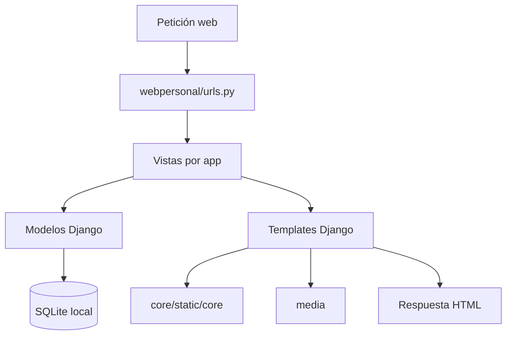

# Arquitectura

DelfoFolio es un proyecto Django monolítico organizado por áreas de contenido. La aplicación utiliza templates Django para renderizar páginas HTML y modelos para el contenido que se administra desde Django Admin.

## Flujo MVT

1. `webpersonal/urls.py` recibe la ruta y la conecta con una vista.
2. La vista consulta el modelo correspondiente cuando la página tiene contenido dinámico.
3. El template recibe el contexto y construye la respuesta HTML.
4. Los templates cargan assets desde `core/static/core/` y archivos subidos desde `media/`.

## Proyecto principal

`webpersonal/` contiene la configuración global, las rutas y los puntos de entrada WSGI y ASGI. `settings.py` registra las apps, configura templates, base de datos, archivos estáticos, media y variables de entorno.

## Apps

- `core/`: páginas transversales, layout común, contacto y catálogo de tecnologías.
- `portfolio/`: modelo `Project`, proyectos generales y dashboards Power BI.
- `dataset/`: modelo `Dataset` y listado de recursos.
- `formacion/`: cursos y formación académica.
- `laboral/`: experiencia laboral.

Cada área mantiene sus vistas, templates, administración y migraciones cuando corresponde. `core/templates/core/base.html` actúa como layout común mediante herencia de templates y parciales.

## Persistencia y migraciones

Los modelos de portfolio, datasets, formación y experiencia se almacenan en la base configurada por Django. Las migraciones de cada app describen la evolución del esquema; la base SQLite local no forma parte del repositorio público.
